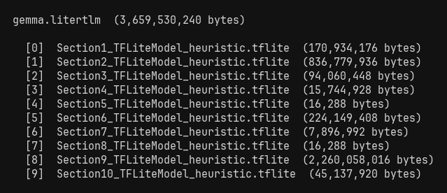
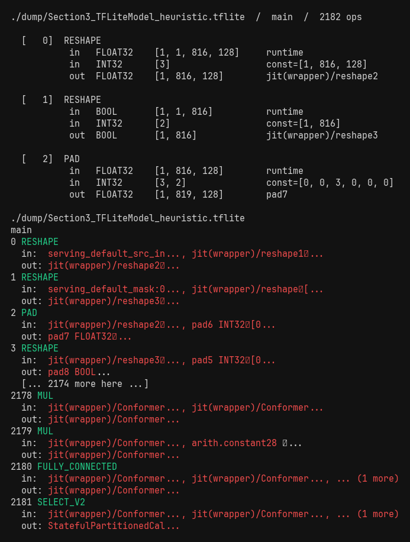
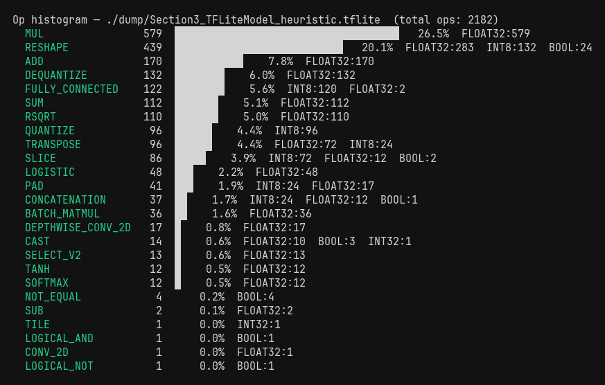
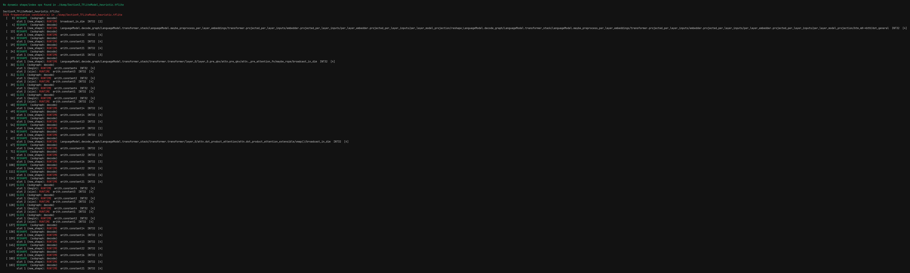
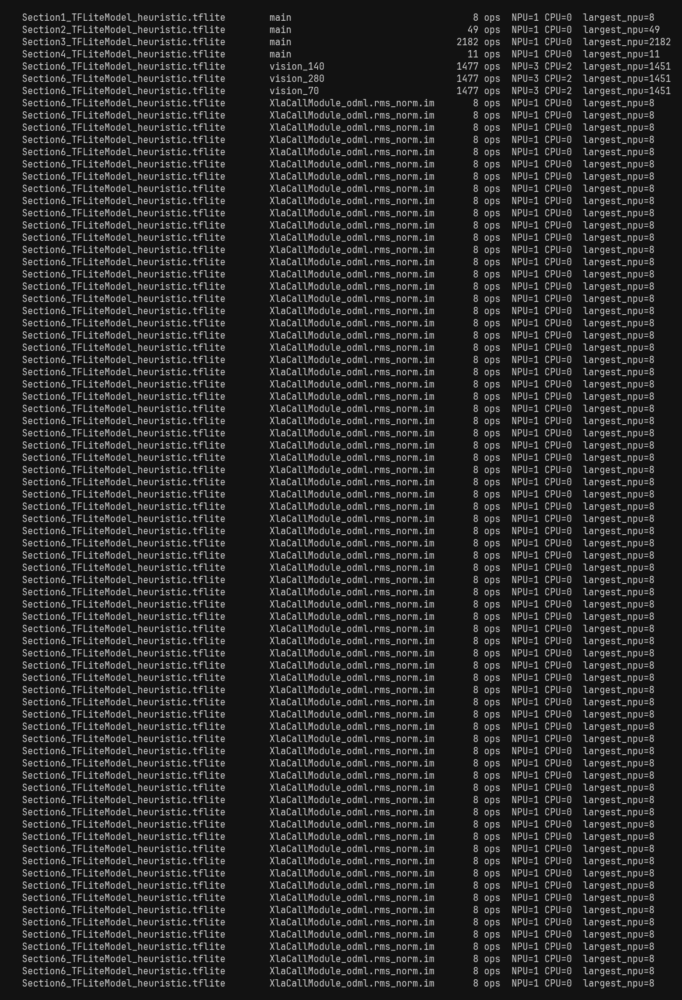
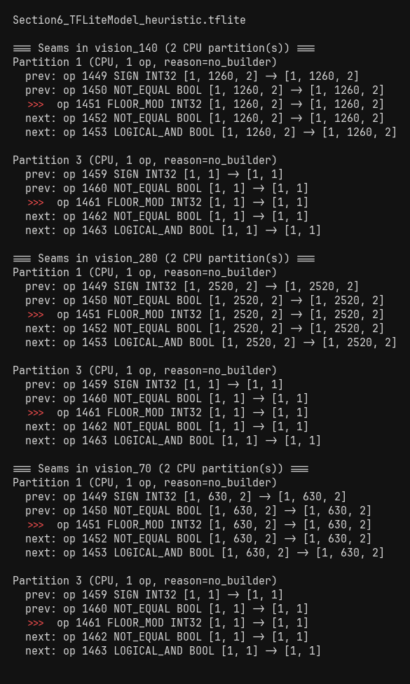
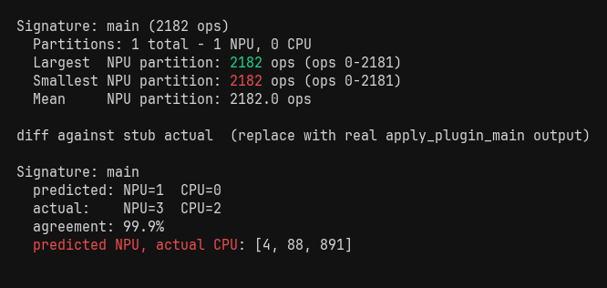

# tinygraphparser

Parse TFLite / LiteRT-LM graphs and detect statically visible blockers to QNN delegate partitioning (missing builders, non-constant shape/index inputs).

## Setup

```
uv sync
uv run python examples/main.py
```

## Extract

Scans the binary for `TFL3` magic bytes. For each hit, walks back ~100 bytes to find a plausible flatbuffer root offset and slices out the blob. Writes each section as a separate `.tflite` file.

```python
from tinygraphparser import LiteRTLMExtractor

tflite_files = LiteRTLMExtractor.extract("model.litertlm", "./dump")
# ["./dump/Section1_TFLiteModel_heuristic.tflite", ...]
```



## Parse

Walks the flatbuffer: subgraphs → operators → tensors. For each input tensor, checks `model.Buffers(t.Buffer()).DataLength() > 0` to determine constness. INT32 constant buffers are decoded as little-endian int32 arrays and stored in `const_values`.

```python
from tinygraphparser import TFLiteGraphParser

graph = TFLiteGraphParser().parse(tflite_files[2])
# graph["subgraphs"][0]["ops"][0]["inputs"][1]["is_constant"]  -> True
# graph["subgraphs"][0]["ops"][0]["inputs"][1]["const_values"] -> [1, 128, 42]
```

Graph shape:
```python
{
  "path": str,
  "subgraphs": [{
    "name": str,
    "ops": [{
      "index":   int,
      "opname":  str,
      "inputs":  [{"name": str, "dtype": str, "shape": list,
                   "is_constant": bool, "const_values": list | None,
                   "tensor_index": int}],
      "outputs": [{"name": str, "dtype": str, "shape": list,
                   "tensor_index": int}],
    }]
  }]
}
```



## Op histogram

Counts ops by opname using `collections.Counter`, then groups counts by `output[0].dtype` to surface where mixed-precision is happening. Results are sorted by total count descending.

```python
from tinygraphparser import report_op_histogram

report_op_histogram(graph)
report_op_histogram(graph, top=10)
```



## Dynamic shape detection

For each op in a fixed slot table (`_SHAPE_INDEX_SLOTS`), checks the input slot that carries shape or index data. Two failure modes: `runtime` (the tensor has no backing buffer so the shape is only known at runtime) and `inferred_dim` (the buffer exists but contains `-1`, RESHAPE only, meaning the shape is partially computed). Both prevent static memory layout resolution on the NPU.

```python
from tinygraphparser import report_dynamic_shape_ops

report_dynamic_shape_ops(graph)
```

Checked ops: `RESHAPE`, `PAD`, `PADV2`, `MIRROR_PAD`, `STRIDED_SLICE`, `SLICE`, `GATHER`, `GATHER_ND`, `SCATTER_ND`, `BROADCAST_TO`, `TILE`, `TRANSPOSE`, `RESIZE_BILINEAR`, `RESIZE_NEAREST_NEIGHBOR`



## Partition simulation

For each op, eligibility = `opname in opSupportMap` AND `op not flagged by find_dynamic_shape_ops`. Ops are walked linearly; a new partition is flushed whenever eligibility changes or the CPU fallback reason changes (so `no_builder` and `dynamic_shape` runs are never merged). This identifies statically visible fragmentation candidates. Real partitioning also depends on dtype, attribute, and SDK-level checks not modeled here.

```python
from tinygraphparser import load_op_support, simulate_partition, report_partitions

op_support = load_op_support("analysis/opSupportMap.csv")
partitions = simulate_partition(graph, op_support)
report_partitions(partitions)
```

CPU fallback reasons: `no_builder` · `dynamic_shape` · `unsupported_composite`



## Seam dump

Resolves each CPU partition's `op_indices` back to positions in the flat ops list, then prints `context` ops before and after the partition body. Use this to see exactly what op caused a split without re-running the full analysis.

```python
from tinygraphparser import report_seams

report_seams(graph, partitions, context=2, kind="CPU")
```



## Predicted vs actual

Expands each partition's `op_indices` range into a set of individual op indices, then intersects with `actual["cpu_op_indices"]`. `divergent_ops` = predicted NPU but actually CPU; these indicate factors not modeled by this simulator. `agreement` is the fraction of ops where both verdicts match.

```python
from tinygraphparser import compare_to_actual, report_comparison

actual = {
    "main": {
        "npu_partitions": 4,
        "cpu_partitions": 3,
        "cpu_op_indices": [488, 891, 1450],
    }
}
diffs = compare_to_actual(partitions, actual)
report_comparison(diffs)
```


