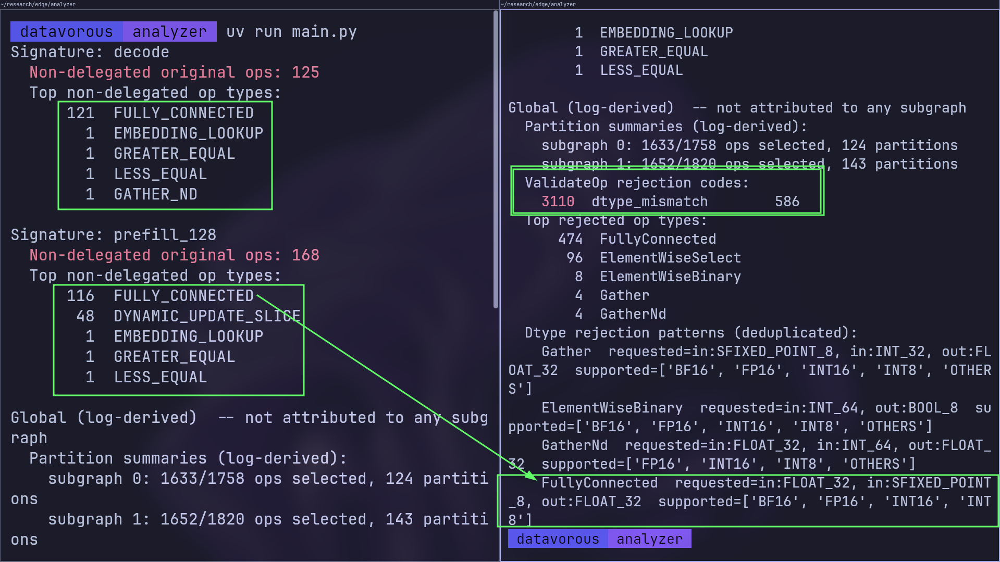

# LensRT

TFLite graph analyzer for QNN delegation diagnostics.

## Install

```bash
git clone git@github.com:datavorous/LensRT.git
cd LensRT && uv sync
```

Static analysis works after this. For runtime analysis see [Runtime setup](#runtime-setup) below.

## Usage

### Static

```python
from lensrt import Static

s = Static("models/qwen.tflite", "datasets/opSupportMap.csv")
s.report()
data = s.json()
```

For `.litertlm` files:

```python
s = Static.from_litertlm("model.litertlm", "datasets/opSupportMap.csv")
```

### Runtime

```python
from lensrt import Runtime

r = Runtime(
    model="models/qwen.tflite",
    plugin="path/to/libLiteRtCompilerPlugin_Qualcomm.so",
    tool="path/to/apply_plugin_main",
    soc="SM8650",
    qnn_lib="path/to/qairt/lib/x86_64-linux-clang",
    out="./runtime_out",
)
r.report()
data = r.json()
```



| Op | Category |
|---|---|
| FULLY_CONNECTED | Export fix (quantization) |
| GATHER_ND | Export fix (INT64 to INT32) |
| GATHER | Export fix (quant params) |
| DYNAMIC_UPDATE_SLICE | Closed SDK |
| ElementWiseSelect | Closed SDK |
| EMBEDDING_LOOKUP | Investigate |
| GREATER_EQUAL | Accept (cold path) |
| LESS_EQUAL | Accept (cold path) |

Closed SDK :: Builder exists, `ConvertOp` runs, `ValidateOp` called, rejected with no diagnostic message. Nothing we can read statically or from logs tells us why. Qualcomm's `backendValidateOpConfig` for this op on SM8650 rejects it silently.

Outputs written to `out=`:
- `rewritten.tflite`: flatbuffer with `DISPATCH_OP` nodes
- `run.log`: `apply_plugin_main` log

## What it checks

### Static
- Missing QNN builder
- Input rank exceeds QNN cap
- Dynamic shape or index input
- Inferred -1 dim (RESHAPE, PAD, BROADCAST_TO, TILE)
- Cross-signature divergence

### Runtime
- Per-subgraph delegated/non_delegated op counts from rewritten flatbuffer
- Global ValidateOp rejection codes from log (not per-subgraph)

## Runtime setup

Runtime needs LiteRT built from source plus the QNN SDK. Skip this if static is enough.

### 1. LiteRT + bazel

```bash
git clone https://github.com/google-ai-edge/LiteRT.git
# bazelisk auto-fetches bazel 7.7.0 from .bazelversion
pip install bazelisk
```

### 2. QNN SDK

Download Qualcomm AI Runtime Community v2.46.0.260424 from
softwarecenter.qualcomm.com (Qualcomm account required). Unzip so the
layout is `qairt/2.46.0.260424/{bin,include,lib,...}`.

### 3. Make QAIRT a bazel workspace

```bash
cp LiteRT/third_party/qairt/qairt.BUILD qairt/2.46.0.260424/BUILD
echo 'workspace(name = "qairt")' > qairt/2.46.0.260424/WORKSPACE
```

### 4. Build the binaries

```bash
cd LiteRT
QAIRT=/absolute/path/to/qairt/2.46.0.260424

bazel build //litert/tools:apply_plugin_main \
  --override_repository=qairt=$QAIRT

bazel build //litert/vendors/qualcomm/compiler:qnn_compiler_plugin \
  --override_repository=qairt=$QAIRT
```

First build is 15-30 min. Outputs:

- `LiteRT/bazel-bin/litert/tools/apply_plugin_main`
- `LiteRT/bazel-bin/litert/vendors/qualcomm/compiler/libLiteRtCompilerPlugin_Qualcomm.so`

### 5. System libs

Arch:

```bash
sudo pacman -Sy libc++
# only if libunwind.so.1 is missing
ln -sf /usr/lib/libunwind.so.8 /usr/lib/libunwind.so.1
```

Ubuntu / Debian:

```bash
sudo apt install libc++-dev libc++abi-dev libunwind-dev
```

Verify (should print nothing):

```bash
ldd LiteRT/bazel-bin/litert/vendors/qualcomm/compiler/libLiteRtCompilerPlugin_Qualcomm.so | grep "not found"
```

### 6. Plug paths into Runtime()

```python
Runtime(
    model="path/to/model.tflite",
    tool="LiteRT/bazel-bin/litert/tools/apply_plugin_main",
    plugin="LiteRT/bazel-bin/litert/vendors/qualcomm/compiler/libLiteRtCompilerPlugin_Qualcomm.so",
    qnn_lib="qairt/2.46.0.260424/lib/x86_64-linux-clang",
    soc="SM8650",
    out="./runtime_out",
)
```

## Common SoC strings

| Device | `soc=` |
|---|---|
| Snapdragon 8 Gen 3 | SM8650 |
| Snapdragon 8 Gen 2 | SM8550 |
| Snapdragon 888 | SM8350 |

## Limitations
- Static checks are necessary but not sufficient for delegation
- Runtime error codes are log-global, not per-subgraph
- Delegated = DISPATCH_OP present; actual backend (HTP/HVX/GPU) determined by QNN runtime, not this tool
- opSupportMap.csv pinned to LiteRT commit b2df679f
